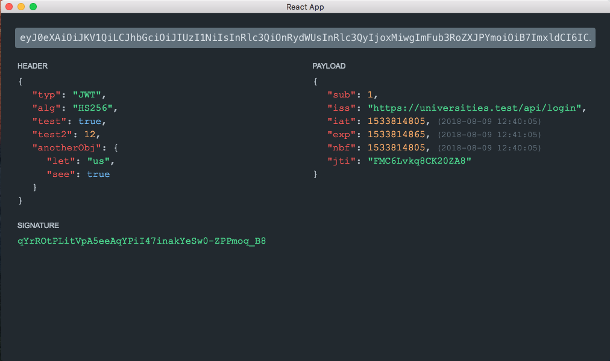

### JWT Inspector

---

To use, clone the repository, and run these commands:

1. `yarn` to install dependencies
1. `yarn build` to compile assets
1. `yarn app` to run the electron app.

Alternatively, you can use it in a browser, [here](http://jwt.jaketaylor.co).

### Screenshot

